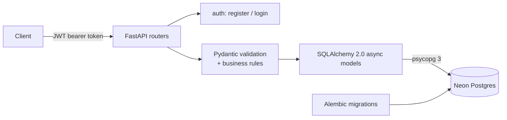

# fastapi-service

> Personal Indian Equity Research & Swing-Trade Journal API — a multi-user REST API for
> tracking NSE stock research, brokerage calls, trade setups, and trades. FastAPI, async
> SQLAlchemy 2.0 + psycopg 3, Neon Postgres, Alembic, JWT auth.

[](https://github.com/Prithv122/fastapi-service/actions/workflows/ci.yml)

**Live demo:** not deployed yet — runs locally against a free-tier Neon Postgres database.
**Stack:** Python 3.13 · FastAPI · Pydantic v2 · SQLAlchemy 2.0 (async) · psycopg 3 ·
Alembic · Neon Postgres · PyJWT + bcrypt · pytest + pytest-asyncio + httpx · Docker ·
GitHub Actions · uv.

---

## 1. The problem

Swing-trading India-listed equities means running the same research loop over and over:
deep-dive a stock, form a thesis with entry/stop/target levels, size a position against
that risk, and — months later — check whether the call actually held up. Doing this in a
notes app loses the history: a thesis quietly gets edited in place, so there's no way to
ask "what did I actually believe on the day I bought this?" This API is a personal journal
for that loop — stocks, versioned research notes, planned trade setups, and executed trades
— with server-side business rules (price ordering, minimum risk/reward, per-user isolation)
enforced instead of trusted to whatever wrote the last edit.

## 2. The data

| | |
|---|---|
| Source | Invented for this project — no real portfolio or research data is included |
| Size | 4 NSE-style tickers (ARVINDTECH, BHARATGREEN, NEXUSFIN, ORBITDEF), ~10 research notes, 4 trade setups, 4 trades — see `scripts/seed.py` |
| Licence | N/A (synthetic) |
| Refresh | One-off seed script, re-runnable against a clean database |

The schema and seed data are modeled on a real personal research workflow (a Notion
tracker with per-stock deep-dive pages, refreshed over time, plus multi-broker holdings
across Zerodha and Groww) — but the actual seeded companies, prices, and theses are
fictional. See `NOTES.md` for how the domain was derived.

## 3. Architecture



Layers: **routers** (HTTP concerns, auth dependency, response models) → **Pydantic
schemas** (request validation, including the setup risk/reward rule) → **SQLAlchemy
models** (persistence, computed properties like realized P&L) → **Neon Postgres**.
Alembic owns schema evolution independently of the app's own runtime.

## 4. Key decisions & tradeoffs

| Decision | Chose | Over | Why |
|---|---|---|---|
| Research history | Append-only `ResearchNote` rows, one per refresh | An editable note with `updated_at` | A trading thesis needs to be judged against what was known at the time it was made — editing in place destroys that. `GET /stocks/{ticker}/history` surfaces the resulting call timeline directly. |
| Async driver | SQLAlchemy 2.0 async engine on **psycopg 3** for both the app and Alembic | asyncpg (app) + psycopg2 (Alembic) | One driver instead of two; psycopg 3 supports sync and async natively, so the migration runner and the request path share a dependency instead of duplicating one. |
| Authorization failure mode | Every owned-resource lookup returns **404** on a cross-user access attempt | Returning 403 | A 403 confirms the object exists; a 404 doesn't leak that. Tested directly in `tests/test_authorization.py` — a second user holding a real UUID cannot distinguish "not mine" from "doesn't exist." |
| Money and price fields | `Decimal` end to end (Postgres `NUMERIC`) | `float` | Rounding errors on financial values are a real bug class; a swing-trade journal that quietly drifts P&L by fractions of a rupee isn't trustworthy. |
| Password hashing | `bcrypt` directly | `passlib[bcrypt]` | passlib's bcrypt backend breaks on `bcrypt>=4.1` (it probes a removed `__about__` attribute) and hasn't shipped a fix; bcrypt alone is simpler and actively maintained. |

## 5. Results

| Metric | Value | Baseline | Notes |
|---|---|---|---|
| Tests | **27 passed**, 0 failed | — | pytest + pytest-asyncio + httpx, run against the real Neon database inside a per-test SAVEPOINT that's always rolled back |
| Coverage | **86%** (`--cov=src`) | — | `cli.py` (uvicorn bootstrap) is the main gap — exercised manually, not by the suite |
| Authorization | 4 dedicated cross-user isolation tests | — | User B holding a real UUID for User A's stock/research note/setup/trade gets 404 on every route, never 200 or 403 |
| CI | Ephemeral Postgres 16 service container | — | CI never touches the real Neon credentials; `alembic upgrade head` runs against the throwaway CI database as its own migration-path check |

All numbers above are from `uv run pytest --cov=src --cov-report=term-missing` against the
real (migrated) Neon database, seeded via `scripts/seed.py`.

## 6. How to run

```bash
git clone https://github.com/Prithv122/fastapi-service.git
cd fastapi-service
uv sync
cp .env.example .env   # fill in DATABASE_URL (Neon) and JWT_SECRET_KEY
uv run alembic upgrade head
uv run python scripts/seed.py   # optional: load demo data
uv run pytest
uv run fastapi-service --reload
```

Then open `http://127.0.0.1:8000/docs` for interactive API docs. Requires a free
[Neon](https://neon.tech) Postgres database (`DATABASE_URL`, pooled connection string).

## 7. What I'd change at 100× scale

At real multi-user scale, the first thing to break is the append-only `research_notes`
table's unbounded growth per stock — fine at personal-journal volume, but a heavy user
refreshing hundreds of tickers weekly would benefit from a materialized "latest call per
stock" view instead of scanning history on every list request. Second, `TradeSetup`
validation currently runs once at creation time; at scale I'd want to re-validate (or at
least flag) a setup if the linked research note's stance changes after the setup was
created, rather than letting them silently diverge. Third, JWT access tokens have no
revocation path — a production deployment would need refresh tokens with a server-side
denylist, not just short expiry.

---

## References

Domain and schema informed by the project owner's own research workflow (private Notion
database and broker exports) — no external reference implementation consulted.
